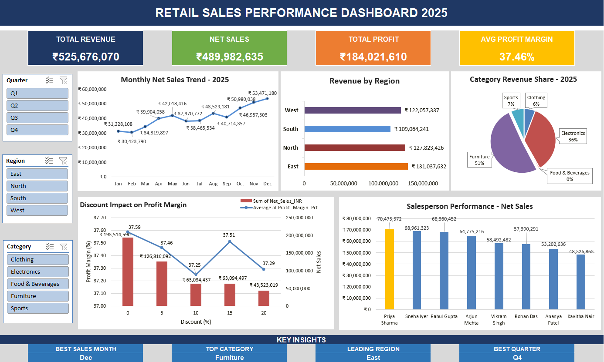

# 🛒 Retail Sales Performance Dashboard — Excel Project

## 📌 Project Overview
An end-to-end data analysis project built entirely in Microsoft Excel,
analyzing retail sales data of ₹52.5 Cr revenue across FY 2025.

## 🎯 Objective
To analyze sales performance across regions, categories, and salespersons
and present findings through an interactive dashboard.

## 📊 Dataset Details
- 1,200+ rows of transactional retail sales data
- 5 Product Categories: Electronics, Clothing, Furniture, Food & Beverages, Sports
- 4 Regions: North, South, East, West
- 8 Salespersons
- 12 Months (Jan–Dec 2025)

## 🛠️ Skills Demonstrated
- Data Cleaning (duplicates, missing values, outliers)
- Pivot Tables (5 pivot tables for multi-dimensional analysis)
- Charts (Line, Bar, Pie, Column, Combo)
- Interactive Slicers (Region, Quarter, Category)
- KPI Dashboard Design
- INDEX-MATCH, SUMIF, AVERAGEIF formulas
- Cross-sheet formula linking

## 🔍 Key Insights
- **December** is the best sales month (festive season peak)
- **East region** leads with ₹1.31 Cr revenue
- **Furniture** dominates with 51% category revenue share
- **Q4** is the strongest quarter overall
- Top salesperson outperforms bottom by ₹22L gap

## 🖼️ Dashboard Preview

